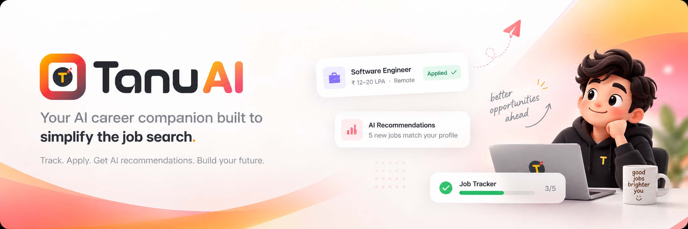
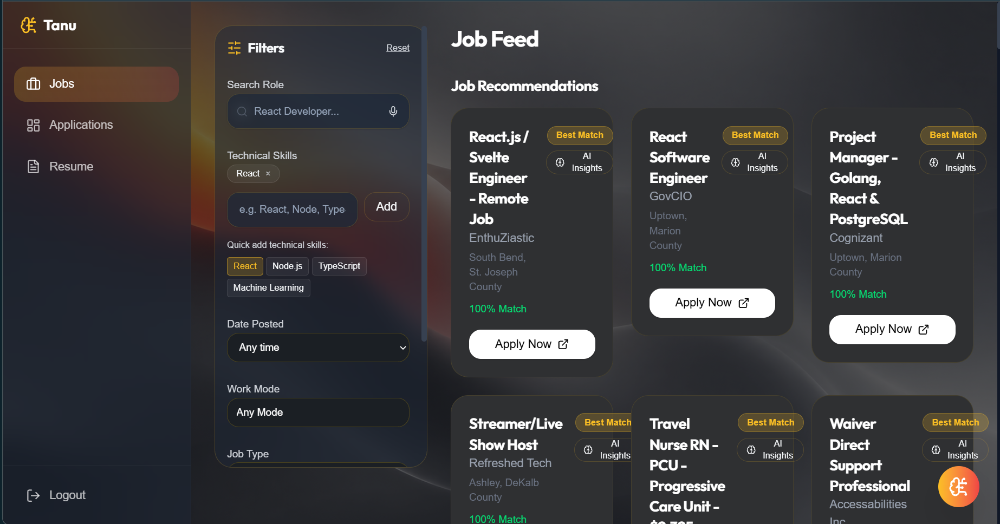

<p align="center">
  
</p>

<p align="center">
  <strong>An AI career companion built to simplify the job search.</strong>
</p>

<p align="center">
  <a href="https://react.dev/"></a>
  <a href="https://www.typescriptlang.org/"></a>
  <a href="https://fastify.dev/"></a>
  <a href="https://vercel.com/"></a>
  <a href="https://render.com/"></a>
  <a href="https://openrouter.ai/"></a>
</p>

<p align="center">
  <a href="https://tanu-ai.vercel.app/">live demo</a> ·
  <a href="#-overview">overview</a> ·
  <a href="#-highlights">highlights</a> ·
  <a href="#-features">features</a> ·
  <a href="#-core-technology">technology</a> ·
  <a href="#-quick-start">quick start</a> ·
  <a href="#-documentation">documentation</a>
</p>

---

## 📌 overview

**TanuAI** is an AI-powered career companion designed to bring the job-search workflow into one focused workspace.

Instead of managing applications across spreadsheets, job portals, resumes, and scattered notes, TanuAI combines application tracking, resume management, job discovery, matching, and AI assistance in a single platform.

The project was built around a simple goal: **reduce the friction of managing a job search and help users stay focused on applying, preparing, and progressing.**

<p align="center">
  
</p>

---

## ✨ highlights

|    | Feature                  | Description                                                     |
| -- | ------------------------ | --------------------------------------------------------------- |
| 📋 | **Application tracking** | Track applications through a structured status workflow         |
| 🤖 | **AI career assistant**  | Use AI-powered assistance throughout the career-search workflow |
| 📄 | **Resume intelligence**  | Upload resumes and extract relevant skills                      |
| 🔎 | **Job discovery**        | Access job data through the Adzuna API                          |
| 🎯 | **Smart matching**       | Match opportunities against the user's career information       |
| 📝 | **Application history**  | Keep notes and application-related information together         |
| 📊 | **Progress dashboard**   | Visualize application activity and career-search progress       |
| 📱 | **Responsive interface** | Modern interface designed to work across screen sizes           |

---

## 🧠 why i built this

Job hunting can get messy very quickly.

While preparing for internships and placements, I found myself spending too much time organizing applications, resumes, job information, and preparation notes instead of actually applying and preparing.

I wanted to build a single workspace that could:

* track every application
* keep career information organized
* surface relevant opportunities
* understand resume skills
* provide AI-powered assistance
* make the overall job-search process easier to manage

**That became TanuAI.**

---

## 🛠️ core technology

| Layer                   | Technology                     |
| ----------------------- | ------------------------------ |
| **Frontend**            | React 18 + TypeScript + Vite   |
| **UI**                  | Tailwind CSS                   |
| **Data fetching**       | TanStack React Query           |
| **Backend**             | Fastify + Node.js + TypeScript |
| **AI**                  | OpenRouter + LangChain         |
| **Job data**            | Adzuna API                     |
| **Frontend deployment** | Vercel                         |
| **Backend deployment**  | Render                         |

TanuAI is split into a frontend application and a lightweight backend API.

The frontend provides the user-facing career workspace, while the backend handles application routes and integrations with external services.

---

## 🤔 features

### Career workspace

* application tracking with status workflows
* application notes and history
* progress dashboard and analytics
* responsive career-focused interface

### AI & resume

* AI-powered career assistant
* resume upload
* resume skill extraction
* personalized job recommendations
* smart job matching

### Job discovery

* job data integration through the Adzuna API
* relevant opportunity discovery
* career information organized around the user's search

### Dashboard

The dashboard brings the main job-search workflow into one place:

* application progress
* job opportunities
* career information
* application activity
* AI assistance

---

## 🌐 web dashboard

The current application is available as a deployed web experience.

**Live demo:**
https://tanu-ai.vercel.app/

<p align="center">
  
</p>

The dashboard is designed around keeping the most important parts of the job search accessible from a single workspace.

---

## 🚀 quick start

### prerequisites

* Node.js
* npm
* API credentials for the external services used by the application

### 1. clone the repository

```bash
git clone https://github.com/helloayushhh/tanu-ai.git
cd tanu-ai
```

### 2. install dependencies

**frontend**

```bash
cd frontend
npm install
```

**backend**

```bash
cd ../backend
npm install
```

### 3. configure environment variables

The application requires environment variables for the external services used by the backend.

Configure the required API credentials in the backend environment before starting the application.

> Keep API keys out of source control. Use a local `.env` file for development.

### 4. run the backend

```bash
cd backend
npm run dev
```

The backend runs locally on:

```text
http://localhost:3001
```

### 5. run the frontend

Open a separate terminal:

```bash
cd frontend
npm run dev
```

The frontend runs locally on:

```text
http://localhost:5173
```

---

## 📁 project structure

```text
tanu-ai/
├── frontend/
│   ├── public/
│   ├── src/
│   │   ├── components/
│   │   ├── hooks/
│   │   ├── pages/
│   │   ├── store/
│   │   ├── lib/
│   │   └── assets/
│   ├── package.json
│   └── vite.config.ts
│
├── backend/
│   ├── src/
│   │   ├── routes/
│   │   ├── lib/
│   │   ├── data/
│   │   └── index.ts
│   ├── package.json
│   └── tsconfig.json
│
├── docs/
│   ├── assets/
│   ├── Tanu_BRD_v1.0.docx
│   ├── Tanu_PRD_v1.0.docx
│   └── Tanu_TRD_v1.0.docx
│
├── .gitignore
├── README.md
└── project_journey.md
```

---

## 📚 documentation

TanuAI is documented beyond the README.

The `docs/` folder contains the product and technical documentation used throughout the project:

* **brd** — business problem, users, objectives, and product scope
* **prd** — product requirements, features, and user flows
* **trd** — technical requirements and implementation direction
* **assets** — project visuals and screenshots

The development process is also documented phase by phase in:

```text
project_journey.md
```

This keeps the README focused on the product while the detailed project decisions remain documented separately.

---

## ☁️ deployment

The current version is deployed using:

| Component          | Platform   |
| ------------------ | ---------- |
| **Frontend**       | Vercel     |
| **Backend**        | Render     |
| **AI integration** | OpenRouter |
| **Job data**       | Adzuna API |

**Live application:**
https://tanu-ai.vercel.app/

**Backend API:**
https://tanu-api-z8ei.onrender.com

---

## 🧭 project journey

TanuAI was developed incrementally, with the product evolving through documented phases.

The complete development journey — from the initial product idea through requirements, technical planning, implementation, and deployment — is maintained separately in:

```text
project_journey.md
```

This repository therefore keeps the **product documentation**, **technical documentation**, and **development journey** separate from the main README.

---

## 📈 current status

**completed and deployed.**

The current version represents the completed scope of the project.

The deployed application reflects the features currently implemented in the repository. Future ideas are intentionally kept separate from the existing product scope.

---

## 🔭 next possibilities

These are future ideas and are **not presented as current features**:

* ATS resume scoring
* AI-powered resume feedback
* cover letter generation
* interview preparation
* company insights
* personalized career roadmaps

---

## 🔗 project links

| Resource              | Link                                    |
| --------------------- | --------------------------------------- |
| **Live application**  | https://tanu-ai.vercel.app/             |
| **Backend API**       | https://tanu-api-z8ei.onrender.com      |
| **GitHub repository** | https://github.com/helloayushhh/tanu-ai |

---

## 👨‍💻 built by

**aps**

TanuAI started as a personal attempt to make the job-search process less scattered and more manageable.

Built while navigating internships, placements, product thinking, and the process of turning an idea into a real deployed product.

---
